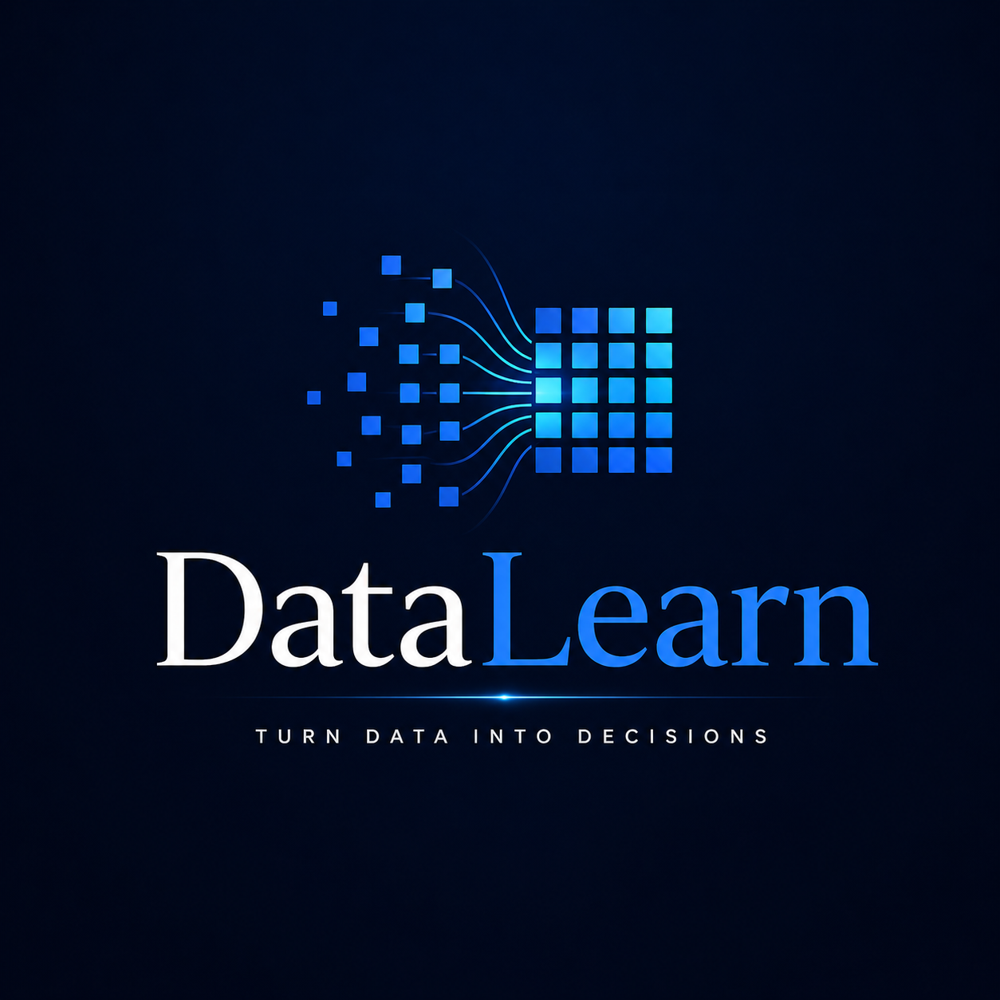
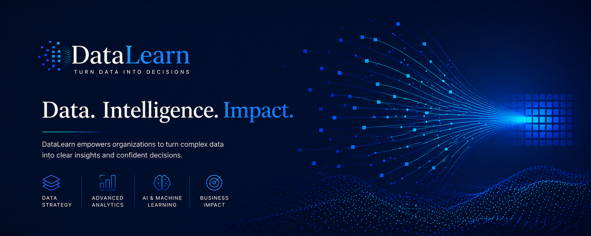
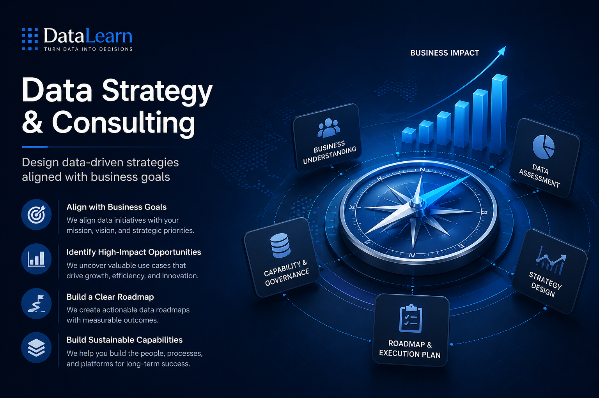
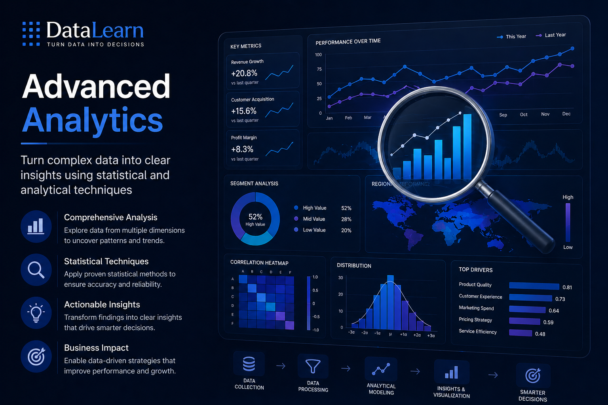
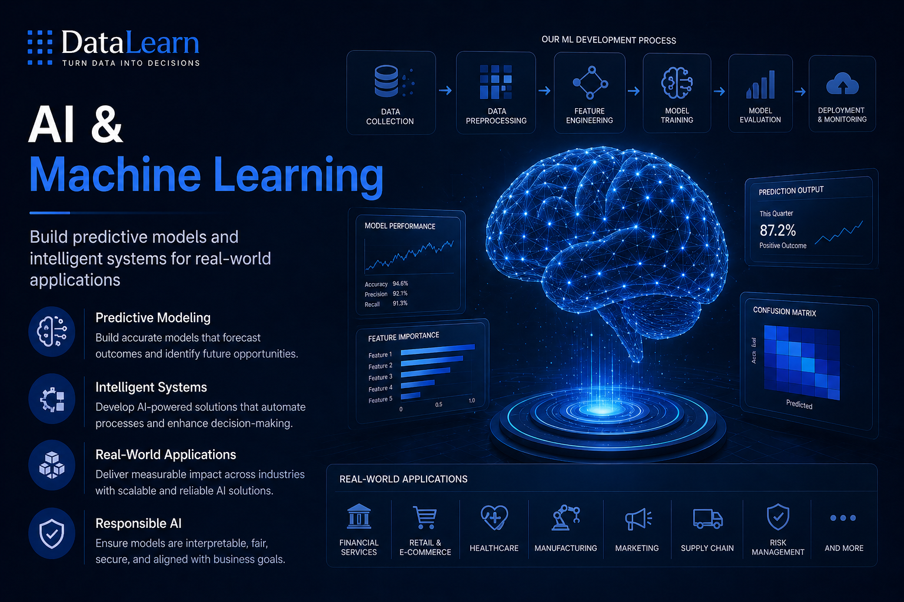
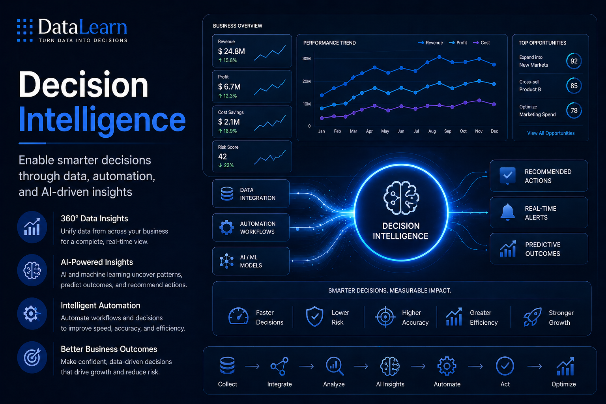
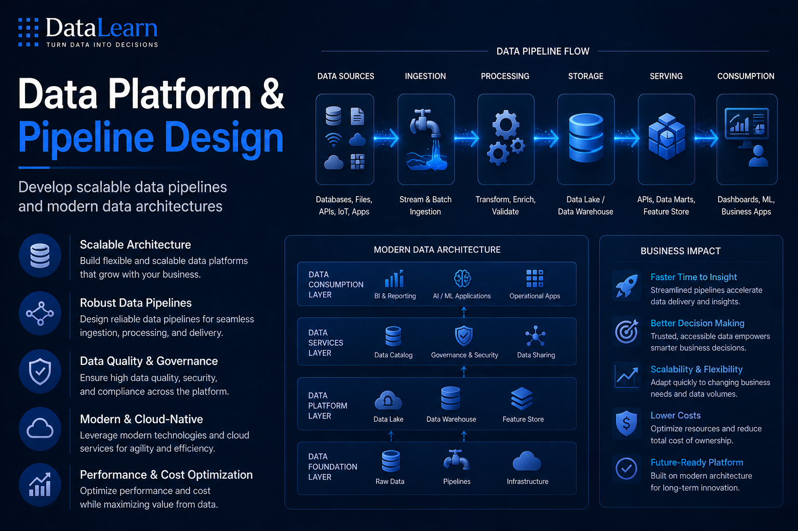
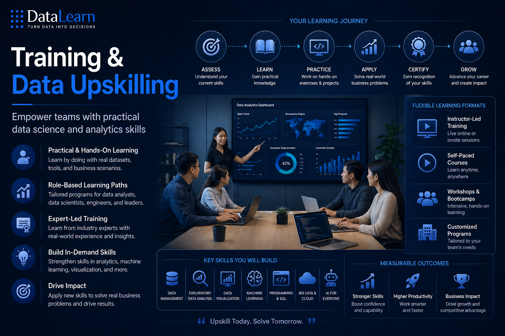

# DataLearn Brand Assets

> **DataLearn — Turn Data Into Decisions**

DataLearn is an AI-powered data analytics brand focused on helping organizations transform data into insights, intelligence, and measurable business impact.

---

## 1. Logo

### Primary Logo


<p align="center">
  
  <br/>
  <em>End-to-end ML pipeline</em>
</p>

<!--
[DataLearn Primary Logo](images/logo_datalearn.png)
-->

**Style:** Premium enterprise, AI technology, data-driven  
**Colors:** Dark blue, white, cyan gradient  
**Tagline:** Turn Data Into Decisions

### Logo Concept

The DataLearn logo represents the transformation of raw data into structured intelligence.  
The icon uses a grid and data-flow structure to symbolize:

- Data collection
- Data transformation
- Analytical thinking
- AI-powered decision making
- Business impact

---

## 2. LinkedIn Page Cover

### Page Cover



### Cover Message

**Data. Intelligence. Impact.**

DataLearn empowers organizations to turn complex data into clear insights and confident decisions.

### Key Themes

- Data Strategy
- Advanced Analytics
- AI & Machine Learning
- Business Impact

---

## 3. Service Showcase Images

## 3.1 Data Strategy & Consulting



**Description:**  
Design data-driven strategies aligned with business goals.

**Focus Areas:**

- Align data with business priorities
- Identify high-impact opportunities
- Build clear data roadmaps
- Develop sustainable data capabilities

---

## 3.2 Advanced Analytics



**Description:**  
Turn complex data into clear insights using statistical and analytical techniques.

**Focus Areas:**

- Exploratory data analysis
- Statistical modeling
- Insight generation
- Business performance optimization

---

## 3.3 AI & Machine Learning



**Description:**  
Build predictive models and intelligent systems for real-world applications.

**Focus Areas:**

- Predictive modeling
- Feature engineering
- Model evaluation
- Deployment and monitoring
- Responsible AI

---

## 3.4 Decision Intelligence



**Description:**  
Enable smarter decisions through data, automation, and AI-driven insights.

**Focus Areas:**

- AI-powered recommendations
- Decision automation
- Real-time alerts
- Predictive outcomes
- Business optimization

---

## 3.5 Data Platform & Pipeline Design



**Description:**  
Develop scalable data pipelines and modern data architectures.

**Focus Areas:**

- Data ingestion
- Data processing
- Data storage
- Data serving
- Data governance
- Modern data architecture

---

## 3.6 Training & Data Upskilling



**Description:**  
Empower teams with practical data science and analytics skills.

**Focus Areas:**

- Practical data analytics training
- Role-based learning paths
- Machine learning foundations
- Data visualization
- SQL and programming
- Business-focused data thinking

---

## 4. Brand Positioning

DataLearn helps organizations move from data collection to business impact by combining strategy, analytics, AI, and practical training.

### Brand Promise

**From Data to Intelligence. From Intelligence to Impact.**

### Core Message

DataLearn turns complex data into clear decisions.

---

## 5. Favourite Quotes

> “Turn Data Into Decisions.”

> “From Data to Intelligence. From Intelligence to Impact.”

> “Complex data. Clear decisions.”

> “Data is nothing until it drives action.”

> “Better data. Better decisions. Better outcomes.”

---
<!--
## 6. Suggested GitHub Folder Structure

```text
assets/
│
├── logo/
│   └── datalearn-primary-logo.png
│
├── cover/
│   └── datalearn-linkedin-cover.png
│
└── showcase/
    ├── data-strategy-consulting.png
    ├── advanced-analytics.png
    ├── ai-machine-learning.png
    ├── decision-intelligence.png
    ├── data-platform-pipeline-design.png
    └── training-data-upskilling.png
-->
